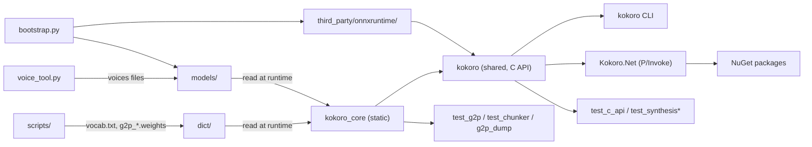
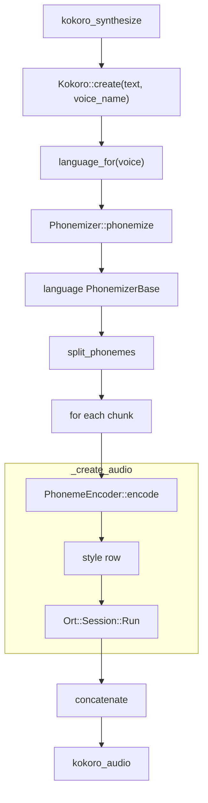

# Architecture

kokoro.cpp runs the [Kokoro-82M](https://huggingface.co/hexgrad/Kokoro-82M) TTS model on ONNX Runtime. Text becomes a
phoneme string through a per-language G2P, and the phonemes become model token ids. Everything is exposed through one
C API, which the CLI, the .NET wrapper and any FFI consumer use.

- [Components at a glance](#components-at-a-glance)
- [From text to audio](#from-text-to-audio)
- [The C API boundary](#the-c-api-boundary)
- [The engine](#the-engine-srckokoro)
- [Text frontends (G2P)](#text-frontends-g2p)
- [Adding a language](#adding-a-language)
- [Front ends](#front-ends)
- [Data and assets](#data-and-assets)
- [Build and tooling](#build-and-tooling)
- [Threading](#threading)
- [Tests and quality gates](#tests-and-quality-gates)
- [Known sharp edges](#known-sharp-edges)

## Components at a glance

| Directory | Role |
|---|---|
| `include/kokoro/` | public C header |
| `src/` | engine, G2P, C API implementation |
| `src/cli/` | CLI |
| `src/chinese_english/`, `src/english/`, `src/spanish/`, `src/german/` | per-language G2P |
| `dotnet/` | wrapper, example, tests |
| `packaging/` | NuGet build scripts |
| `dict/` | runtime G2P data |
| `models/` | downloaded, not committed |
| `third_party/` | onnxruntime, cppjieba, doctest, miniaudio |
| `eval_bench/` | G2P bench |
| `tests/` | ctest and pytest suites |
| `scripts/` | one-off converters |
| `docs/` | guides |

## From text to audio

1. **C API entry.** `kokoro_synthesize` (`src/kokoro_c.cpp`) validates its arguments: speed must be > 0 and finite,
   and the only flag is `KOKORO_INPUT_PHONEMES` (unknown flags are rejected). It zeroes `*out_audio` before any failure
   path, then calls `Kokoro::create(text, voice_name, speed, is_phonemes)`.
2. **Voice and language.** `Kokoro::create` looks up the voice with `get_voice_style`. A missing voice throws
   `std::out_of_range`, which the C layer maps to `KOKORO_ERROR_VOICE_NOT_FOUND`. It then picks the G2P with
   `Kokoro::language_for`:
   - a forced language set by `kokoro_set_language` wins;
   - otherwise the voice prefix decides: `e?_` → Spanish, `d?_` → German, `a?_`/`b?_` → English, anything else →
     ChineseEnglish. The second character must be `f` or `m`, and the third `_`.
3. **Phonemize.** Unless the input is already phonemes, `Phonemizer::phonemize(text, language)` dispatches to that
   language's `PhonemizerBase`. It passes along the number language set by `kokoro_set_number_language`. The result is
   one UTF-8 phoneme string in Kokoro's symbol set.
4. **Chunk.** `split_phonemes` (`src/PhonemeChunker.cpp`) splits at `.,!?;`, trims the segments, and packs them into
   chunks shorter than `MAX_PHONEME_LENGTH` = 510 **bytes**. A single over-long segment stays one chunk.
5. **Encode.** `Kokoro::_create_audio` truncates the chunk to 510 bytes. Then `PhonemeEncoder::encode` maps each UTF-8
   character to its id from `dict/vocab.txt` and **silently drops characters that are not in the vocab**.
   - If the result is empty, no audio is returned and the model is not run. This mirrors upstream, which skips empty
     phoneme strings.
   - Otherwise token 0 is added at both ends.
6. **Style row.** A voice is a table of 256-float rows, normally 510 of them. A chunk of n tokens (padding not
   counted) uses row `min(n, rows) - 1`, matching upstream's `pack[len(ps)-1]`.
7. **Run.** The model's input schema is detected on each call from the session's input names:
   - if an input is named `input_ids`: `input_ids` int64 `[1,N]`, `style` f32 `[1,256]`, and `speed` as **int32**
     (`static_cast<int>`, so the fractional part is dropped);
   - otherwise: `tokens` int64 `[1,N]`, `style` f32 `[1,256]`, and `speed` f32 `[1]`.
   The output is the session's first output: f32 samples at 24 kHz (`SAMPLE_RATE`).
8. **Assemble.** The chunks' audio is concatenated. `trim_audio` currently returns its input unchanged.
   `src/kokoro_c.cpp` copies the samples into a `malloc`'d `kokoro_audio`, which the caller frees with
   `kokoro_audio_free`.

## The C API boundary

Sources: `include/kokoro/kokoro.h`, `src/kokoro_c.cpp`.

- **Context.** `kokoro_ctx` wraps one `Kokoro` plus a cached copy of the sorted voice names. `kokoro_create` is
  `kokoro_create_ex` with NULL options, which means `kokoro_default_options()` = `{KOKORO_DEVICE_AUTO, gpu_id 0}`.
  `kokoro_context_device` reports the device actually in use.
- **Status codes.** `KOKORO_OK`, `KOKORO_ERROR_INVALID_ARGUMENT`, `KOKORO_ERROR_LOAD`,
  `KOKORO_ERROR_VOICE_NOT_FOUND`, `KOKORO_ERROR_INFERENCE`, `KOKORO_ERROR_OUT_OF_MEMORY`, `KOKORO_ERROR_UNKNOWN`.
  - Exceptions never cross the boundary. `std::bad_alloc` becomes the out-of-memory status. Any other `std::exception`
    becomes the call's fallback status: load in create, inference in synthesize, unknown in phonemize.
  - `kokoro_last_error()` reads a `thread_local` message. It stays valid until the next kokoro call on that thread.
- **Ownership.**
  - Audio and phoneme strings are `malloc`'d; the caller frees them with `kokoro_audio_free` / `kokoro_string_free`.
    Both accept NULL.
  - `kokoro_voice_name` returns a pointer owned by the context, valid for the context's lifetime.
- **Setters.** `kokoro_set_language` takes `KOKORO_LANGUAGE_AUTO/SPANISH/CHINESE_ENGLISH/ENGLISH/GERMAN`.
  `kokoro_set_number_language` takes `KOKORO_NUMBERS_AUTO/ENGLISH/CHINESE/SPANISH/GERMAN`. Both reject unknown values.
- **Exports.** Only the C API is exported. CMake sets `CMAKE_CXX_VISIBILITY_PRESET hidden`, and `KOKORO_API` is
  dllexport or default visibility. The CLI links only the shared `kokoro` target, so it sees exactly the surface users
  get.

## The engine (`src/Kokoro.*`)

- **Construction order** (`Kokoro::Kokoro`): `create_session`, then `load_voices`, then
  `PhonemeEncoder::load(dict_dir + "vocab.txt")`, then `Phonemizer(PhonemizerConfig{dict_dir})`. Any failure throws,
  and the C layer reports it as `KOKORO_ERROR_LOAD`.
- **Device selection** (`create_session`):
  - Cpu always builds a CPU session.
  - Auto uses CUDA when ONNX Runtime reports `CUDAExecutionProvider`. If the CUDA session fails to build, it falls
    back to CPU with a warning on stderr.
  - Cuda never falls back.
  - The CUDA provider sets `cudnn_conv_algo_search=HEURISTIC`, because every chunk length is a new input shape.
  - Graph optimization is `ORT_ENABLE_ALL`.
- **Voices file** (`load_voices`):
  - Layout: `VOIC` magic, u32 version 1, u32 count. Then, per voice: u32 name length, UTF-8 name, u32 float count,
    little-endian f32 data.
  - The float count must be a nonzero multiple of 256.
  - If a name appears twice, the later entry wins.
  - Voices are stored in a `std::map`, so names come out sorted.
  - `voice_tool.py` (`save_voices`) and `scripts/export_voices.py` write the same format.
- **Models.** No model file is special-cased. Which model goes with which voices file is a deployment choice; see
  [Data and assets](#data-and-assets).

## Text frontends (G2P)

**Dispatch.** `Phonemizer` (`src/Phonemizer.cpp`) owns a `std::map<G2PLanguage, std::unique_ptr<PhonemizerBase>>`
holding all four languages, built in its constructor; `phonemize` looks the language up with `.at(language)`. The only
interface is `PhonemizerBase::phonemize(text, NumberLanguage)`. `PhonemizerConfig` (`src/Phonemizer.h`) holds every
dictionary file name, relative to `dict_dir`.

**Sharing and loading.**
- `EnglishPhonemizer` and `ChineseEnglishPhonemizer` (through `ZHG2P`) share one `std::shared_ptr<const EnG2P>`. One
  `JiebaProcessor` backs `ZHG2P` and `ZHFrontend`.
- English, Chinese/English and Spanish load eagerly in the constructor; a missing jieba or pinyin file throws.
- `GermanPhonemizer` loads lazily. It keeps the file paths and creates its `std::optional<GermanLexicon>` on the first
  `phonemize`, so contexts that never read German pay nothing. No lock is needed because a context is single-threaded
  by contract.

**Symbol contract.** Every phonemizer must emit only symbols that are in `dict/vocab.txt`, because
`PhonemeEncoder::encode` drops unknown symbols silently.

| Language (`G2PLanguage`) | Pipeline | Data (`dict/`) | Output convention |
|---|---|---|---|
| ChineseEnglish | `ZHG2P::operator()`: `normalize_numbers` → `map_punctuation` (full-width punctuation to ASCII) → `ZHFrontend` (jieba `Tag` segmentation; tag fixes such as `eng` for ASCII words and apostrophe re-join; `PinyinFinder::find_best_pinyin`, word dictionary first, then per character, up to 8 characters; `ToneSandhi` for 不, 一, third tone and neutral tone; erhua merge) → `py2ipa` → `retone` (tone contours to the arrows `↓ ↗ ↘ →`; neutral tone unmarked). English words go through the shared `EnG2P`. | `jieba.dict.utf8`, `hmm_model.utf8`, `user.dict.utf8`, `idf.utf8`, `stop_words.utf8`, `pos_dict/`, `pinyin.txt`, `pinyin_phrase.txt`, plus the English files | IPA with tone arrows |
| English | `EnglishPhonemizer` → `EnG2P::convert`: `user_en.dict` (overrides CMU) → `cmudict-0.7b/cmudict.dict` → possessive `'s` → spell out all-caps words of up to 5 letters → `NeuralG2P` (g2p_en); then ARPAbet to misaki symbols | `cmudict-0.7b/cmudict.dict`, `user_en.dict`, `g2p_en.weights` | misaki US English; single-letter diphthongs `A I O W Y`; stress marks `ˈ ˌ` |
| Spanish | `spanish_to_phonemes`: `normalize_numbers` → scan into Word/Punct/Space segments → per word: loanword respelling (`SpanishLoanwords`: built-in table plus optional `dict/es_loanwords.tsv`), acronym spelling, or rule-based letter-to-phoneme with stress → cross-word allophones → diphthong merge → `tidy_spaces` | optional `es_loanwords.tsv` | espeak-ng `es`; `ˈ` before the stressed vowel |
| German | `german_to_phonemes`: expand `z. B.` and `d. h.` → German number format (`1.000` → `1000`, `3,5` → `3.5`) → `normalize_numbers` → scan → per word: override table, or `GermanLexicon::lookup` (MFA dictionary with the longest variant winning, then memoized compound split into parts of at least 3 code points with linking s allowed, then `NeuralG2P` (g2p_de)), rendered by `part_to_kokoro` (MFA phones to espeak-ng symbols, r vocalization, final devoicing, rule-based stress) → `tidy_spaces` | `german_mfa.dict`, `g2p_de.weights` | espeak-ng `de`; `ˈ` before the stressed vowel |

**Numbers.** `normalize_numbers` (`src/NumberNormalizer.cpp`) rewrites each `[-+]?\d+(?:\.\d+)*` in the chosen
language.
- Under Auto, a number takes the script of the nearest ASCII letter or CJK character before it. If there is none, it
  takes the script of the first such character in the text. If there is none at all, it is read in Chinese.
- Auto never resolves to Spanish or German. The Spanish and German phonemizers map Auto to their own language, and
  `EnglishPhonemizer` maps it to English.
- An explicit number language applies in every phonemizer.

**Shared helpers.**
- `NeuralG2P` (`src/NeuralG2P.*`) is one GRU seq2seq engine. Each caller passes its own `G2PSymbols`, whose index
  order must match the checkpoint: `EnG2P::neural_symbols` for English, `german_symbols` in
  `src/german/GermanLexicon.cpp` for German. It reads `G2PE` v1 weight files written by `scripts/export_g2p.py`.
- `tidy_spaces` (`src/PhonemeText.*`) fixes spacing around punctuation for Spanish and German.

## Adding a language

These are the touch points the German addition went through, in order:

1. Add a `G2PLanguage` enum member in `src/G2PLanguage.h`.
2. Implement `PhonemizerBase` under `src/<language>/` and add its sources to `kokoro_core` in `CMakeLists.txt`.
3. Register it in `Phonemizer::Phonemizer`, adding new file-name keys to `PhonemizerConfig`.
4. Add a voice-prefix `case` to `Kokoro::language_for`.
5. If numbers need it, add a `NumberLanguage` member and word tables, wired into `spoken_number` in
   `src/NumberNormalizer.cpp`.
6. Add `KOKORO_LANGUAGE_*` and `KOKORO_NUMBERS_*` values to `include/kokoro/kokoro.h`, with their `switch` cases in
   `src/kokoro_c.cpp`.
7. Extend the CLI's `parse_language`, `parse_number_language` and usage text in `src/cli/main.cpp`.
8. Add the .NET `KokoroLanguage` and `KokoroNumberLanguage` members in `dotnet/src/Kokoro.Net/KokoroEnums.cs`, and
   extend `dotnet/examples/Kokoro.Interactive/CliParser.cs`.
9. Add a model and voice pack to `bootstrap.py` (`ARTIFACTS`, `VoicePack`, `VOICE_PACKS`).
10. Add G2P goldens to `tests/test_g2p.cpp`, and a `tests/test_synthesis_<lang>.cpp` registered in
    `tests/CMakeLists.txt`.
11. Optionally, add an eval_bench corpus and an entry in `LANGUAGES` in `eval_bench/compare_g2p.py`.

## Front ends

**CLI (`src/cli/`).** `main.cpp` parses the options and creates a context with `kokoro_create_ex`.
- Modes: `--list-voices`; `--phonemize`; single synthesis, which writes a mono 32-bit IEEE-float WAV (format tag 3)
  with the local `write_wav`; and `-i`, which calls `kokoro_cli::run_interactive`.
- Exit codes: 0 on success, 1 on a library error, 2 on a usage error.
- Interactive mode (`src/cli/interactive.cpp`):
  - The main thread only reads lines, with `read_line_utf8` (which uses `ReadConsoleW` on a Windows console).
  - A `synthesis_worker` thread owns the context and drains a `PhraseQueue` (mutex + condition variable + deque).
    Settings are copied into each `Phrase` when it is queued, so later commands affect only later phrases.
  - `AudioPlayer` (`src/cli/audio_player.cpp`) plays the clips through miniaudio, built for playback only. The device
    opens lazily at the first clip's sample rate, and clips are never freed on the audio thread.
  - Commands: `/voice`, `/speed`, `/voices`, `/help`, `/quit`.

**.NET (`dotnet/`).**
- `KokoroNative` calls the C API through `DllImport("kokoro")`, marshalling strings as `LPUTF8Str`. Strings owned by
  the library stay `IntPtr`, so the marshaller never frees them.
- `KokoroContextHandle : SafeHandleZeroOrMinusOneIsInvalid` destroys the context exactly once, after any in-flight
  calls finish.
- `KokoroContext` copies native audio and strings into managed memory and frees the native copies in `finally`. It
  throws `KokoroException`, built from `kokoro_last_error()`. `KokoroContext.BundledDictDirectory` is
  `<AppContext.BaseDirectory>/kokoro-dict`.
- The example `Kokoro.Interactive` follows the C++ interactive design: a `SynthesisWorker` over a `BlockingCollection`,
  and a `ClipPlayer` on NAudio `WaveOut`.

**NuGet (`packaging/`).**
- `Larroy.Kokoro` depends on `Larroy.Kokoro.runtime.win-x64` and `Larroy.Kokoro.runtime.win-arm64`. These carry
  `runtimes/<rid>/native/kokoro.dll` and depend on `Microsoft.ML.OnnxRuntime`, with `ORT_VERSION` from `bootstrap.py`
  as an inclusive minimum.
- `Larroy.Kokoro.runtime.win-x64.cuda` depends on `Microsoft.ML.OnnxRuntime.Gpu.Windows`. Its `prefer-ort-gpu.targets`
  makes the GPU `onnxruntime.dll` win the file conflict.
- `Larroy.Kokoro.targets` copies the bundled `dict/` into `<output>/kokoro-dict`. Models are never packaged.
- The package version comes from `project(KokoroCPP VERSION …)` in `CMakeLists.txt`, read by
  `dotnet/Directory.Build.props`.

## Data and assets

**Model pairings**

| Model | Voices file | Voices | G2P selected by prefix | ctest |
|---|---|---|---|---|
| `kokoro-v1.1-zh.onnx` | `voices-v1.1-zh.bin` | `zf_*`/`zm_*`, `af_maple`… | ChineseEnglish/English | `synthesis`; CLI default |
| `kokoro-v1.0.onnx` | `voices-v1.0-es.bin` | `ef_dora`, `em_alex`, `em_santa` | Spanish | `synthesis_es` |
| `kokoro-de.onnx` | `voices-de.bin` | `df_eva`, `df_victoria`, `dm_bernd`, `dm_martin` | German | `synthesis_de` |

- `bootstrap.py` downloads the three models and `voices-v1.1-zh.bin` as-is (`ARTIFACTS`).
- It builds the other two voices files through `VoicePack` / `install_voice_pack`:
  - `voices-v1.0-es.bin` from raw `.bin` voices (`voice_tool.load_raw`);
  - `voices-de.bin` from each GGUF file's `voice.pack` tensor, keeping its first 510 rows (`voice_tool.load_gguf`).
- Every download and every assembled pack is checked against a SHA-256 and written through a `.part` file.

**`dict/` files**

| File | Read by | When |
|---|---|---|
| `vocab.txt` | `PhonemeEncoder` | context creation |
| jieba files, `pos_dict/`, `pinyin*.txt` | `JiebaProcessor` / `PinyinFinder` | context creation; a missing file throws |
| `cmudict-0.7b/cmudict.dict`, `user_en.dict`, `g2p_en.weights` | `EnG2P` | context creation; a missing file prints a warning |
| `es_loanwords.tsv` | `SpanishLoanwords` | context creation; optional and not in the repo |
| `german_mfa.dict`, `g2p_de.weights` | `GermanLexicon` | first German phonemize; a missing file prints a warning |

**Generators**
- `scripts/export_vocab.py` writes `vocab.txt` from `kokoro_onnx`'s vocab.
- `scripts/export_g2p.py` writes the `g2p_*.weights` files from the g2p `.npz` checkpoints.
- `scripts/export_voices.py` converts `.npy`/`.npz` voices.
- `scripts/convert_dict.py` is a one-off with hard-coded paths that produced the pinyin files.
- `voice_tool.py` (`blend`, `import-pt`) derives new voices files; see `docs/adding-voices.md`.

## Build and tooling

- **`bootstrap.py` commands** (the ONNX Runtime version is pinned by `ORT_VERSION` = `1.23.2`):
  - `configure`: picks an ONNX Runtime package (`--ort auto|cpu|gpu`), installs it into `third_party/onnxruntime/`
    with a `.archive` stamp, then runs `install_artifacts`. With `auto`, it detects NVIDIA GPUs and their compute
    capability through `nvidia-smi` and needs a driver that supports CUDA 12.8 or newer.
  - `build`: CMake configure and build, using Ninja when it is available.
  - `build-ort`: builds ONNX Runtime 1.23.2 with CUDA from source and stamps it, so a later `configure` keeps it.
  - `fetch-ort`: fetches the pinned ONNX Runtime only, for packaging and cross builds.
- **CMake targets:**
  - `kokoro_core`: static library of every internal source;
  - `kokoro`: shared library built from `src/kokoro_c.cpp` only, linking `kokoro_core` and ONNX Runtime;
  - `kokoro_cli`: the CLI (output name `kokoro`), linking `kokoro` and miniaudio;
  - the tests;
  - `g2p_dump` (in `eval_bench/`), linking `kokoro_core`.
- **ONNX Runtime lookup:** `-DONNXRUNTIME_ROOT`, then `third_party/onnxruntime`, then Homebrew on macOS, then
  `/usr/local`.
- **Windows:** there is no rpath, so `onnxruntime.dll` and its provider DLLs (except TensorRT's) are copied next to
  `kokoro.dll` and next to every test executable that links `kokoro`.
- **Install:** `find_package(kokoro)` provides `kokoro::kokoro`.

## Threading

- Separate contexts are independent and may run on different threads. A single context must never be used by two
  threads at once, and nothing in `src/` takes a lock.
- Error messages are per thread.
- Each context holds its own ONNX Runtime session, model copy and dictionaries.
- The recommended pattern is one worker thread that owns the context, which is what both the CLI's interactive mode
  and the .NET example do.

The full contract is in [docs/thread-safety.md](docs/thread-safety.md).

## Tests and quality gates

- **ctest:**
  - `c_api`, `g2p` and `chunker` need no model.
  - `synthesis`, `synthesis_es` and `synthesis_de` need their model pair. They exit 77 when a file is missing, which
    is registered as `SKIP_RETURN_CODE 77`.
  - `g2p` pins the G2P output for zh/en/es/de, including number reading.
- **`uv run pytest`:** `tests/python/` covers `voice_tool.py` (including the voices-format round-trip and GGUF parsing)
  and the ONNX Runtime/CUDA choice logic in `bootstrap.py`.
- **eval_bench:** `eval_bench/compare_g2p.py --language es|de` compares `g2p_dump` output with espeak-ng, using
  `eval_bench/espeak_oracle.py` to reproduce misaki's setup.
  - It reports the phoneme error rate.
  - It exits 1 if a mismatch is not listed in `corpus/<lang>_known_diffs.tsv`.
  - It is run by hand; `ci.yml` does not run it.
- **CI:**
  - `.github/workflows/ci.yml` runs `configure`, `build` and `ctest` on linux-x64, linux-arm64, macos-arm64,
    windows-x64 and windows-arm64.
  - `.github/workflows/pack.yml` builds the native libraries, runs `ctest -R c_api` and `dotnet test`, packs, smoke-tests
    the packages (`packaging/smoke.ps1`), and publishes on `v*` tags.

## Known sharp edges

- `trim_audio` (`src/Kokoro.cpp`) is a no-op, so `trim=true` changes nothing.
- A single phoneme segment longer than 510 bytes is truncated to 510 bytes. The limit counts bytes, and the encoder
  drops a UTF-8 character cut at the boundary.
- Models with an `input_ids` input receive the speed as int32, so its fractional part is lost.
- Phonemizer output symbols that are missing from `vocab.txt` vanish without a warning.
